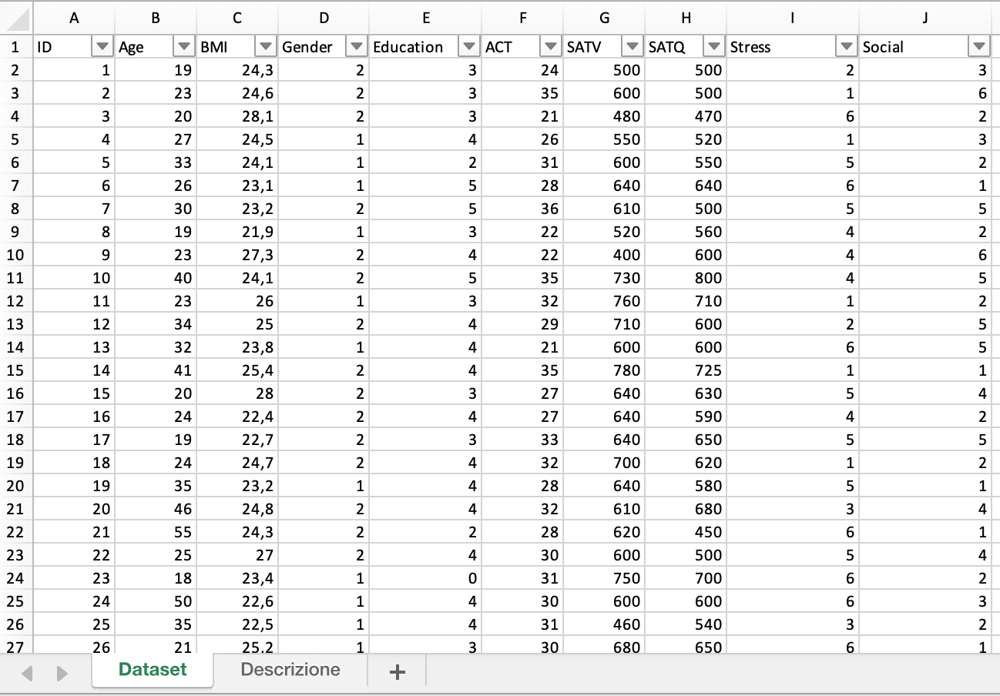
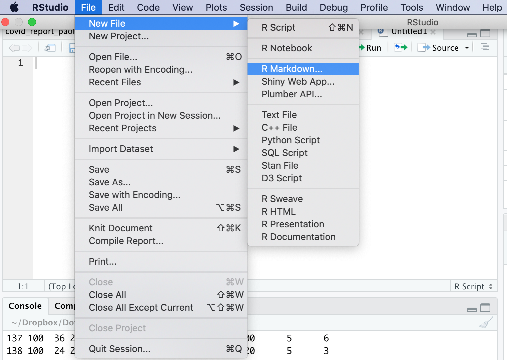
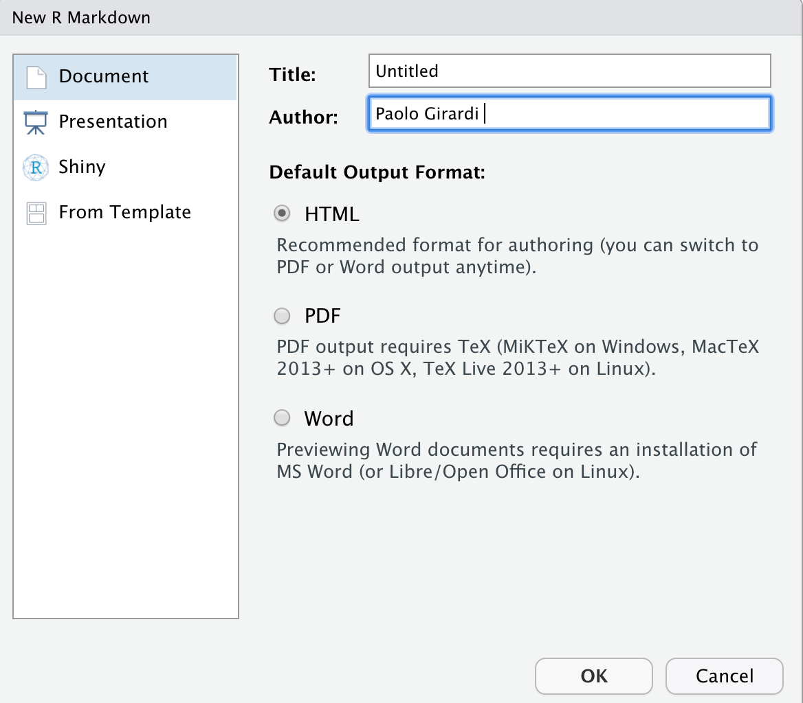
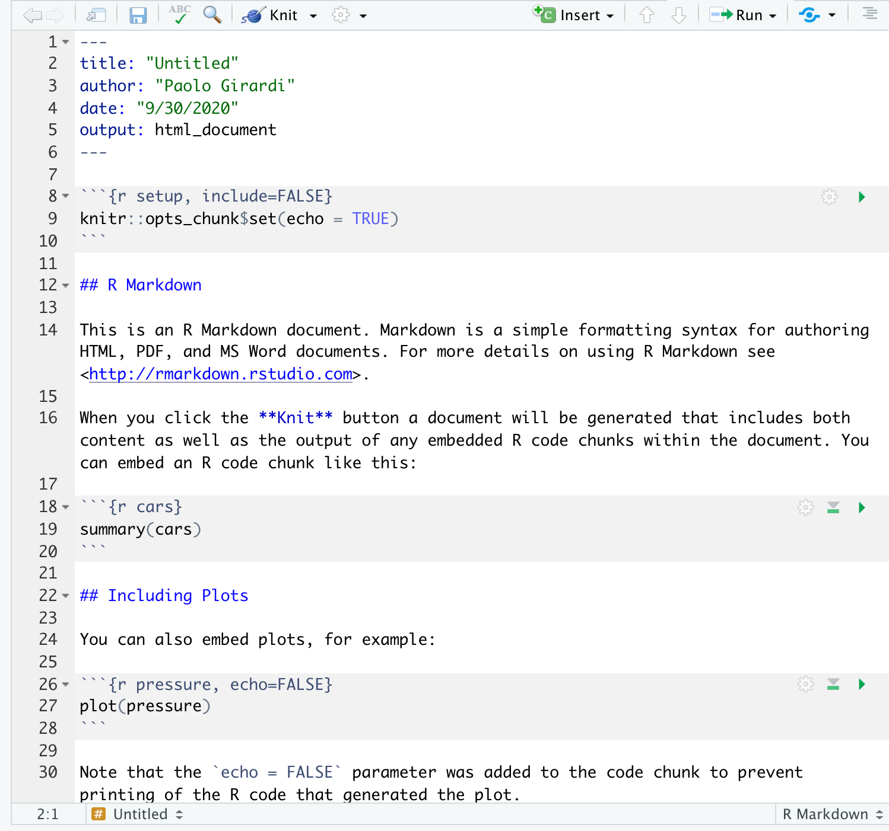

\newpage
\begin{center}
Ph.D. Course in Neuroscience   
Calendar of the Basic Courses – Academic Year 2020-2021   
Basic Concept of Statistics   
\  
Lesson 1 - Optional and preliminary course on use of R  
\end{center}


```{r setup, include=FALSE}
knitr::opts_chunk$set(echo = TRUE)
```

```{r , echo=FALSE}
# Outline

#- Basic use of R  
#- Introduction to reproducibility with R-Markdown  
```

# Basic use of R 
## Working-space and helps
R is an integrated software environment for data manipulation, computation and
graphic representation. To start a session, it is necessary to perform a double
mouse click on the icon of R or (RStudio). This will open the command window e
the command prompt will be proposed:  
*>*  
  
The entities that R creates during a work session are called objects. These latter can be numbers, strings, vectors, matrices, functions, or more general structures. Such items are saved by name and stored in a dedicated area called workspace. At any time, it is possible check the objects available in the workspace using the command *ls()*


```{r}
ls()
# empty workspace
```

I can remove an objects with the command *rm()*
```{r}
rm(thing)
# attention... no thing in the working space
```

The working space can be saved and restore with the commands *save.image()* and *load()*
```{r}
save.image("my_working_space.Rdata")
load("my_working_space.Rdata")
```
Files can be loaded and saved in a specific working directory in a local folder.
We can use the functions *setwd()* and *getwd()* to set or to retrieve the folder location.
```{r}
setwd("/Users/Paolo/My_Website/content/it/courses/PhD_neuroscience/")
getwd()
```

For any request of help about R functions, a series of help function can be used
```{r}
help(setwd)
?setwd
# and if I don't remember the function name help.search() or apropos()
apropos("setw")
```

## Basic operation 
R can be employed as a simple scientific calculator 
```{r}
1+1
3/2
1>2
```

using a several number of local functions. Each function can be applied by means of round brackets with an argument inside
```{r}
#squared root 
sqrt(2)
#log - natural basis
log(10)
#exponential  
exp(4)
#sin function
sin(pi)
# the result is 0... pi is the greek pi constant
pi
#I can combine more functions
log(sqrt(2))*exp(4)
```
I can assign to an object values or results of operations as follows
```{r}
x<-1
x
y<-3/2
y
z<-1>2
z
```
## Vectors and Matrix  
To create a vector, a basic function is *c()* 
```{r}
x<-c(1,2,3,9,12)
x
```
or a sequence can be created in these two ways
```{r}
x1<-1:20
x1
x2<-seq(from=1,to=20,by=1)
x2
# the result is the same
```
Other useful functions are
```{r}
#replicate
x<-rep(2,5)
x
#multiplicate for scalar *
x<-1:5
x<-x*3
# x has been overwritten... pay attention!
x
# other functions
sum(x)
prod(x)
min(x)
max(x)
length(x)
```

A matrix can be define with command *matrix()*
```{r}
mat<-matrix(data=1:9,nrow=3,ncol=3)
mat
# by default elements are placed by col
```
and square brackets are used to select elements in a vector or matrix as follows
```{r}
# in a vector
x[3]
x[1:2]
# in a matrix
mat[1,2]
mat[1:2,3] 
# creating subselection 
x[-1] #dropping the first element
mat[-1,] #for the first row
```
## Type of ojects in R 
In R we can define a many type of data. R can be automatically define an object on the basis of the object characteristics.  
A numeric vector
```{r}
x<-1:3
is(x)
is.numeric(x)
```
A matrix
```{r}
mat<-matrix(data=1:9,nrow=3,ncol=3)
is(mat)
```
A char vector (a vector of letters or even not numbers)
```{r}
label<-c("white","red","black")
is(label)
```
I can combine numbers and characters in a list 
```{r}
list<-list(x,label)
list
list[[1]] # first element of a list with double square brackets
```
and rename each single element
```{r}
names(list)<-c("numbers","colours")
```
We can combine number and characters in a data.frame
```{r}
data<-data.frame(numbers=x,colours=label)
data # the result is a typical dataset format
```
## Import a dataset
R permits to import data in several format and from other statistical softwares (STATA, SPSS, SAS, EXCEL, etc.. ). When R import a file it creates a data.frame object. For each format there are specific functions. We are going to explore the most used functions.  
However, a beginner user can follow a guided importation process from   
*File > Import Dataset >   *
and then to select the importing format.  

A classical format for dataset is the text (extension csv, txt, dat).  
Text can be imported in R with the function *read.csv()* or *read.table()*.
This dataset called "test" collected the results on proficieny test (SAT and ACT) in a sample of 150 students. 
Students are by row, while characteristics by column.
In Excel we have this output:

{width=50%}

We save them in a CSV format and import with the function \textit{read.csv()} in R.

```{r}
test<-read.csv("test.csv",sep=";",header=T,dec=",")
head(test) #the first 6 rows
names(test)
```


# Reproducible Statistical Analysis with R-Markdown

## Why use R-Markdown

The use of RStudio with R-Markdown provides the basis to edit text and executable R code is the same text file.   
R-Markdown permits to  
- create HTML, PDF, or MS Word output;  
- use beamer, ioslides, and slidy presentations;
- manage tables, figures and bibliographies;
- create a customizable environment.
  
There are a lot of sites. More about R Markdown:
  
- [rmarkdown.rstudio.com](http://rmarkdown.rstudio.com)  
- [online reference guide](https://www.rstudio.com/wp-content/uploads/2015/03/rmarkdown-reference.pdf)  


---

## Create an RStudio project


## Create an Rmd report

From RStudio, create a new R Markdown file

{width=50%}


Select HTML output (for now). We can change it later.  

{width=50%}


An untitled R Markdown file is created with some default text and R code. 

{width=50%}

*File* -> *Save As* to the project directory with an Rmd suffix, for example, `test-report.Rmd`. 


Click `Knit HTML` to render the document in HTML. 

The report appears in your RStudio viewer (or can be opened in other HTML viewer).


---

## Compare the markup to the output

Compare the Rmd markup to the HTML output. For example, 

- markup  `<http://rmarkdown.rstudio.com>` creates a link,  <http://rmarkdown.rstudio.com>  
- markup `**Knit**` produces a bold typeface,  **Knit**  
- single backtick markup \` produces highlighted inline code `Knit`.
- markup `*Knit*` produces an italic typeface,  *Knit*


The code-chunk markup 

<pre class="r"><code>```{r}
summary(cars)
<code>```</code>
</code></pre>

echoes the R code in the HTML document, executes the *summary()* function, and writes the result to the output. 

```{r}
summary(cars)
```

The next code chunk includes an `echo=FALSE` argument that prevents printing the R code chunk to the output. 

<pre class="r"><code>```{r, echo=FALSE}
plot(cars)
<code>```</code>
</code></pre>


However, the code is executed and the graph is printed to the output document.


## What the software is doing

{width=50%}

The resulting output file is placed in the same directory as your Rmd file.


---

## Changing the output format

The YAML header  or front-matter in the Rmd file controls how the file is rendered. (YAML: YAML Ain't Markup Language)

<pre class="r"><code>---
title: "Untitled"
author: "Paolo Girardi"
date: "October 08, 2020"
output: html_document
---</code></pre>

Let's change the title to *Test Report*.

<pre class="r"><code>title: "Test Report"
</code></pre>

The `output:` option recognizes three document types:

- html_document  
- pdf_document  
- word_document  

You can type these directly in the Rmd YAML header or you can use the RStudio `Knit` pulldown menu


---

## Formatting the output

Articles on the RStudio website for formatting output. 

- [Formatting an HTML document](http://rmarkdown.rstudio.com/html_document_format.html)
- [Formatting a PDF document](http://rmarkdown.rstudio.com/pdf_document_format.html)
- [Formatting a Word document](http://rmarkdown.rstudio.com/articles_docx.html)


---

## Markdown basics

### Section headings

{width=50%}

### Emphasis

{width=50%}

### Itemize 

Sub-items begin with 4 spaces.   
Every line ends with two spaces.  

{width=50%}

### Enumerate     

Sub-items begin with 4 spaces.   
Every line ends with two spaces.  

{width=50%}


## Including Plots

You can also embed plots, for example:

```{r pressure, echo=FALSE}
plot(pressure)
```

Note that the `echo = FALSE` parameter was added to the code chunk to prevent printing of the R code that generated the plot.

<pre class="r"><code>```{r pressure, echo=FALSE}
plot(pressure) ```</code></pre>

# Data visualization and base statistics with R  


## The normal distribution  

R has some basic functions for calculating density, cumulative distribution function and
quantiles for many distributions of interest. It is also possible to generate achievements'
pseudo-random from the distribution. For example, considering the distribution
normal standard, there are 4 main functions:  

- dnorm (x) calculates the density value in x;  
- pnorm (x) calculates the value cumulative   distribution function into x;   
- qnorm (p) computes the quantile of level p;  
- rnorm (n) generates a sample from a normal standard of size n (N(0,1)).  

The prefix (d, p, q and r) descriminates the type of function associated to the random variable.
R contains some functions related to several random variables by default. In particular 
````{r , echo=FALSE}
table<-rbind(
c("norm","normal","mean, sd","0, 1"),
c("lnorm","log-normal","meanlog, sdlog","0, 1"),
c("t","t di Student","df","-"),
c("chisq","chi-quadrato df","-"),
c("f","F","df1, df2","-, -"),
c("unif","uniform","min, max","0, 1"),
c("exp","exponential","rate","1"),
c("gamma","gamma","shape, scale","-, 1"),
c("binom","binomial","size, prob","-,-"),
c("pois","Poisson","lambda","-"))
names(table)<-c("Name","Distribution","Parameters","Default")
library(knitr)
kable(table)
```
Other random variables can be added with "external R-Packages" or built by yourself. Some example of the functions related to the normal  
```{r , echo=FALSE}
# dnorm
dnorm(0) #the density in 0 for N(0,1)
pnorm(0) #the CDF in 0 for N(0,1)
qnorm(0.5) #the quantile in 0.5 for N(0,1)
rnorm(3) #3 random values from N(0,1)
# to obtain the same random values
# I need to set the seed
set.seed(1)
rnorm(3) 
# the N(0,1) shape with the function curve()
curve(dnorm(x),-3,3)
curve(pnorm(x),3,-3)
# we add a second CDF with sd=0.3 in red, note the presence of add=T
curve(pnorm(x,sd=0.3),3,-3,add=T,col=2)
```

## To build a function in R  

R permits to build personal functions.  
The structure is similar to other programming codes.
The function \textit{function()} permits to define a new function. Here an example that returns the area
````{r , echo=FALSE}
myfunction<-function(b,h){
area<-b*h
return(area)
}
myfunction(b=10,h=4)
```
We can expand this function calculating the perimeter and the area returning a list  
```{r , echo=FALSE}
myfunction<-function(b,h){
area<-b*h
perimeter<-(b+h)*2
return(list(area=area,perimeter=perimeter))
}
myfunction(b=10,h=4)
```

## Basic statistics function with R  

From the last imported dataset test
```{r}
test<-read.csv("test.csv",sep=";",header=T,dec=",")
head(test) #the first 6 rows
```
Useful functions to visualize a dataset are:  

- \textit{View()}: to visualize a dataset like in rows and columns   
- \textit{str()}: to analyse the structure of a dataset  
- \textit{names()}: to obtain the name of each variabile in a vector 
```{r}
#View(test)
str(test) 
names(test) 
```
Some useful functions for basic statistics:  

- \textit{summary()}: compute a 5 number of Tukey + mean for numeric variables or frequency for categorical variables
- \textit{plot()}: an object sensitive function, perform a barplot for categorical or dispersion diagram for numeric variables 
- others: \textit{sd()} compute standard deviation, \textit{length()} the number of element in a vector, \textit{dim()} the dimensions of a dataset or array, \textit{median()} compute the median, \textit{quantile()} calculates the quantile of a vector, \textit{scale()} standardize a numeric vector, \textit{IQR()} interquantile range
```{r}
summary(test$Age)
plot(test$Age)

summary(test$Gender)
plot(test$Gender)
```
Now we try to build a function that extract from a numeric vector mean, sd, median, IQR and the length:
```{r}
fun_sum<-function(x){
c(M=mean(x),SD=sd(x),Me=median(x),IQR=IQR(x),n=length(x))
}
fun_sum(test$Age)
```
